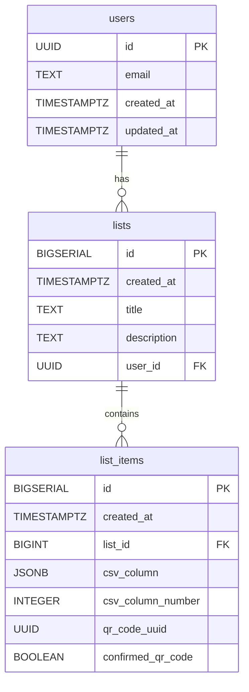

# SupaQR バックエンド

このディレクトリには、QR Connector プロジェクトの Supabase バックエンド設定が含まれています。データベースのマイグレーション、関数、アクセス制御ルールなどが含まれます。

## データベーススキーマ

以下の図はデータベーススキーマを示しています:

## ディレクトリ構成

- `migrations/`: データベーススキーマの変更を管理する SQL ファイルが含まれています。
