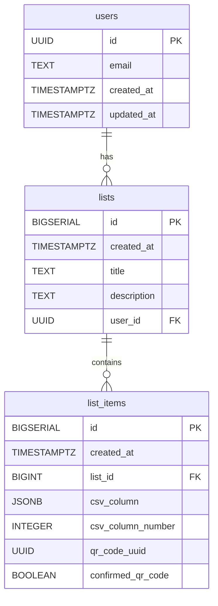

# SupaQR Backend

This directory contains the Supabase backend configuration for the QR Connector project. It includes database migrations, functions, and access control rules.

## Database Schema

The following diagram illustrates the database schema:

## Directory Structure

- `migrations/`: Contains SQL files for database schema changes.
